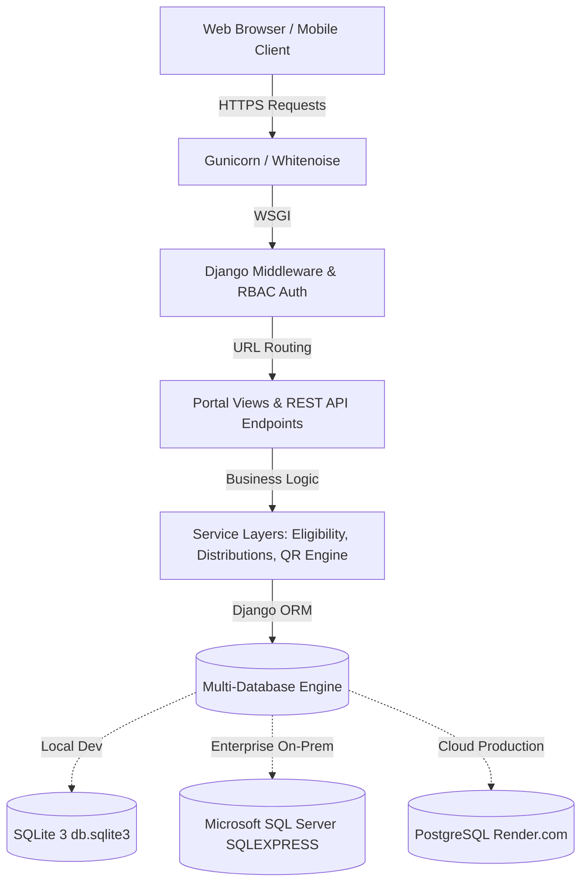
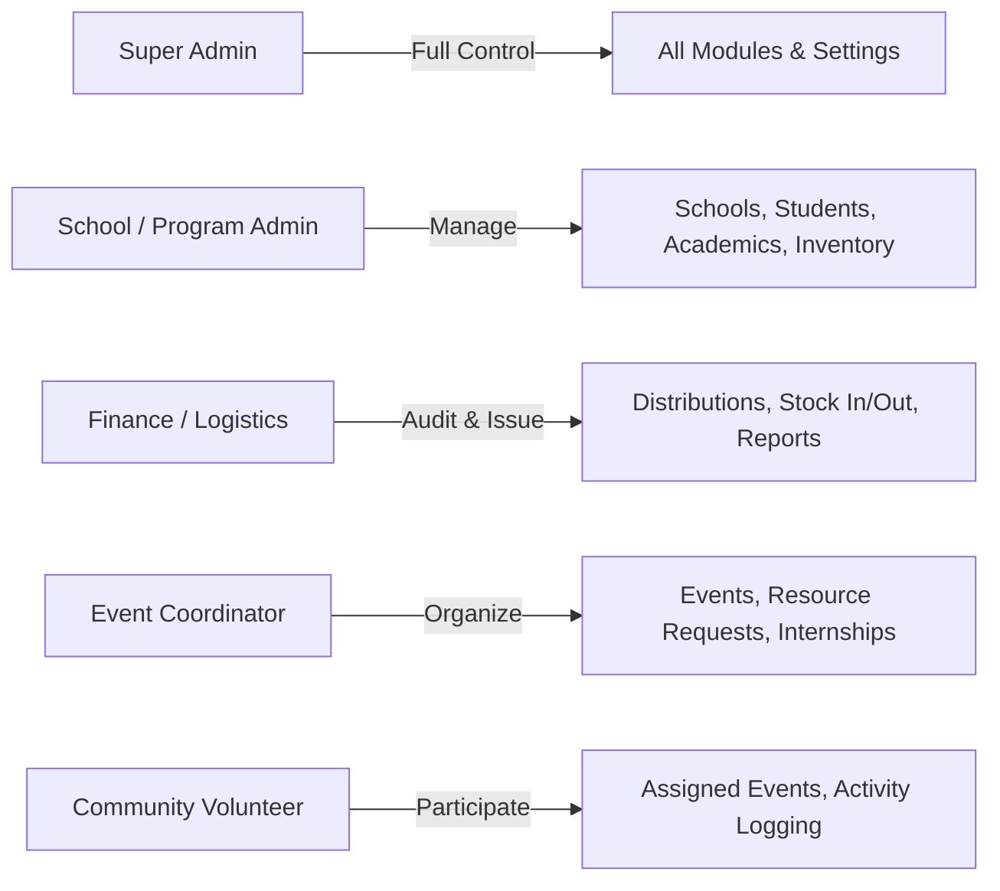
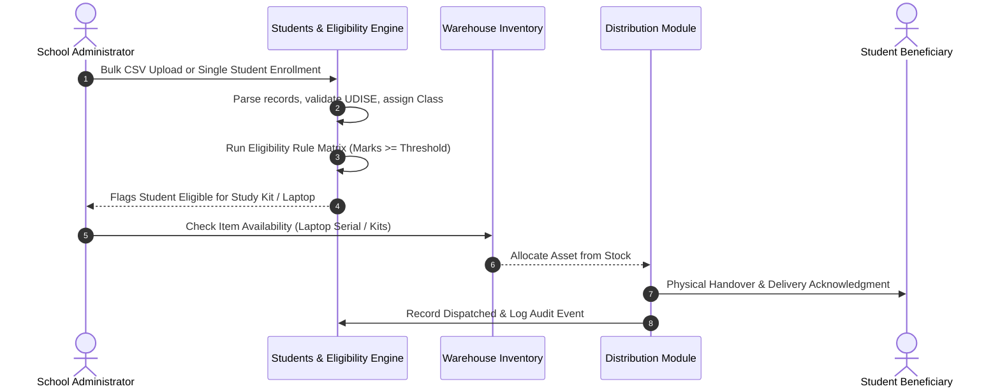
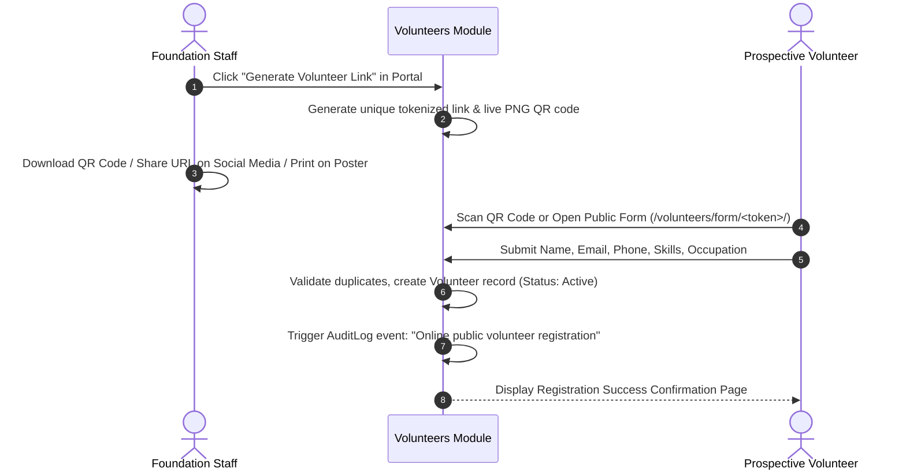
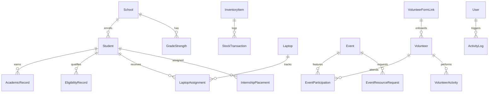

# Aequs EduTrack — Complete Platform Overview

## 1. Executive Summary & Vision

**Aequs EduTrack** is an enterprise-grade educational CSR (Corporate Social Responsibility) and logistics management platform developed for the **Aequs Foundation**. Built to empower underprivileged students and support government and partner schools across Karnataka (centered around the Belagavi industrial hub), EduTrack digitizes and unifies the entire educational assistance lifecycle.

The platform bridges institutional administration, student academic performance, supply chain logistics, corporate internships, and community volunteer drives into a single, cohesive, role-protected web portal.

```
┌──────────────────────────────────────────────────────────────────────────────────┐
│                             AEQUS EDUTRACK PLATFORM                              │
├───────────────────┬───────────────────┬───────────────────┬──────────────────────┤
│    INSTITUTION    │      STUDENT      │   SUPPLY CHAIN    │    OUTREACH & CSR    │
│  • Schools Portal │  • Demographics   │  • Warehouse Item │  • Volunteer System  │
│  • Grade Matrix   │  • Academics & GPA│  • Laptop Tracking│  • Event Management  │
│  • Infrastructure │  • Eligibility    │  • Study Kit Pack │  • Public QR Links   │
│  • Headmasters    │  • Promotion Logic│  • Stock Movement │  • Activity Auditing │
└───────────────────┴───────────────────┴───────────────────┴──────────────────────┘
```

---

## 2. System Architecture & Technology Stack

EduTrack is designed with an enterprise Model-View-Template (MVT) architecture, prioritizing high performance, zero superfluous dependencies, relational integrity, and cross-environment deployment flexibility.



### Technology Matrix

| Layer | Technologies & Libraries | Architectural Role |
| :--- | :--- | :--- |
| **Backend Core** | Python 3.14, Django 6.1 | MVC core engine, ORM, atomic transactions, session security |
| **Frontend UI** | Django Templates, Semantic HTML5, Vanilla CSS | Lightweight, custom design system, zero client-framework bloat |
| **Design System** | Aequs Royal Blue (`#1E3A8A`, `#2563EB`), Slate Palette | Modern shadcn-inspired card aesthetics, responsive grid layouts |
| **Iconography & Fonts**| Lucide Icons (Local Bundle), Inter / Montserrat typography (Self-hosted) | Modern vector icons and self-hosted clean data-dense typography |
| **Database Tier** | PostgreSQL, SQLite 3, Microsoft SQL Server | Multi-database support configured via `DATABASE_URL` or `DB_ENGINE` |
| **Asset & Reporting** | `openpyxl` 3.1, `Pillow` 12.3, `qrcode` 8.2 | Excel roster exports, image uploads, live PNG QR generation |
| **DevOps & Hosting** | Docker multi-stage build, Render PaaS, Whitenoise, Gunicorn | Containerized deployment, automatic migrations, static caching |
| **Automated Testing** | Django Test Runner, Python `unittest` | 78 automated test cases verifying models, APIs, and permissions |

---

## 3. Role-Based Access Control (RBAC)

The system enforces strict permission boundaries through a custom User model supporting 5 distinct operational roles:



| User Role | Dashboard & Portal Access | Key Permissions & Responsibilities |
| :--- | :--- | :--- |
| **Super Admin** | Global Access across all portals | User management, system configuration, database seeding, audit compliance |
| **Admin** | Schools, Students, Academics, Inventory, Reports | Student enrollment, academic evaluation, bulk CSV uploads, inventory handover |
| **Accountant** | Distributions, Inventory Ledger, Reports, Exports | Approves material distributions, laptop lifecycle, financial audits, Excel exports |
| **Event Coordinator**| Events Portal, Inventory Requests, Internships | Plans educational events, requests warehouse supplies, assigns student interns |
| **Volunteer** | Volunteer Portal, Event Participation | View assigned activities, log hours contributed, participate in school drives |

---

## 4. Deep-Dive: Core Functional Modules

### 4.1. Partner School Administration (`schools`)
* **School Directory**: Comprehensive profiles tracking UDISE code, operational status, taluk/district/village hierarchy, and headmaster contacts.
* **Grade-Level Strength Matrix**: Grade-by-grade student headcount tracking across Grades 1 through 10.
* **Infrastructure Tracking**: Logs facilities allocated to partner schools, including computer labs, smart classrooms, science labs, and libraries.
* **Milestones & Grants**: Institutional milestone timeline recording grants, awards, and physical infrastructure upgrades.

### 4.2. Student Identity & Enrollment (`students`)
* **Central Roster**: Searchable roster recording admission numbers, gender, date of birth, category, contact info, and assigned partner school.
* **Bulk Ingestion Pipeline**: High-speed CSV batch import engine with column validation, duplicate detection, and atomic transaction guarantees.
* **Student Status Lifecycle**: Active enrollment, transferred, graduated, or dropout status tracking with historical audit logs.

### 4.3. Academics & Performance Engine (`academics`)
* **Grade & Marks Ledger**: Records exam performances, subject-wise scores, total marks, percentage, and class ranking.
* **Promotion Status Engine**: Automatically determines student academic standing: `Promoted`, `Conditional`, or `Non-Promoted`.
* **Dynamic CourseMaster**: Dynamic curriculum catalog separating standard K-10 school grades from higher education diploma/degree programs (PUC, ITI, Diploma, BE).

### 4.4. Student Benefit Eligibility Matrix (`eligibility`)
* **5 Core Benefit Types**: Evaluates student qualifications for:
  1. **Textbooks**: Universal and category-based curriculum book allocations.
  2. **Workbooks**: Supplementary exercise materials for high-need grades.
  3. **Study Kits**: School bags, stationery packs, geometry boxes, notebooks.
  4. **Laptops**: Merit-based hardware awards for top-performing secondary/pre-university students.
  5. **Industrial Internships**: Corporate skill placements at Aequs SEZ manufacturing units.
* **Smart Class Resolver**: Robust parsing resolving equivalent educational terms (`10th` $\leftrightarrow$ `Class 10`, `PUC` $\leftrightarrow$ `12th`) to eliminate classification discrepancies.

### 4.5. Warehouse Supply Chain & Laptop Inventory (`inventory`)
* **General Inventory**: Stock-in (vendor/donor receipts) and stock-out (school/event distribution) ledgers for kits, uniforms, and stationery.
* **Low-Stock Triggers**: Visual indicators (In Stock, Low Stock, Depleted) alerting administrators when supplies drop below threshold.
* **Laptop Asset Lifecycle**: Complete tracking of laptop serial numbers, hardware specifications, condition, student handovers, and hardware returns.

### 4.6. Benefit Distributions Logistics (`distributions`)
* **Logistics Ledger**: Verification workflow ensuring items are issued only to verified, eligible students.
* **Study Kit Assembly**: Multi-item bundling logic grouping individual items into standardized school kits.
* **Handover Acknowledgements**: Digital delivery receipts recording distribution date, issuer, and student confirmation.

### 4.7. Corporate & Industrial Internships (`internships`)
* **Corporate Program Tracks**: Manages training tracks at Aequs manufacturing units (CNC machining, aerospace tooling, QA, assembly).
* **Candidate Pool & Placement**: Matches eligible vocational/diploma students to corporate mentors.
* **Milestone & Stipend Tracking**: Logs monthly attendance, stipend disbursement, performance evaluations, and completion certificates.

### 4.8. Community Events & Resource Allocation (`events`)
* **Event Workflows**: Organizes educational workshops, medical camps, annual school days, and material distribution drives.
* **Cross-Module Resource Requests**: Directly links events to the warehouse inventory, allowing coordinators to requisition kits and equipment in advance.
* **Volunteer Deployment**: Allocates registered community volunteers to specific event roles.

### 4.9. Volunteer Management & Live QR Registration (`volunteers`)
* **Volunteer Roster**: Manages volunteer contact profiles, skills, occupation, qualification, and cumulative service hours.
* **Tokenized Link Generator (`VolunteerFormLink`)**: Generates unique, secure sharing links for volunteer recruitment campaigns.
* **Live Dynamic PNG QR Code**: Embedded generator producing scannable high-density QR codes (Reed-Solomon Level H error correction) downloadable in PNG format.
* **Public Self-Registration**: Mobile-responsive registration page allowing prospective volunteers to sign up directly without requiring admin intervention.

### 4.10. Executive Analytics, Compliance & Audit (`reports`)
* **Executive KPI Dashboard**: Instant aggregation of active schools, total students, laptops distributed, volunteer hours, and inventory levels.
* **Automated Audit Logging (`reports.middleware.AuditLogMiddleware`)**: Tracks all CRUD operations, user logins, data modifications, and security events.
* **Export Engine**: One-click generation of Excel (`.xlsx`) and CSV reports for government compliance and foundation audits.
* **Real-time JSON Endpoint (`/reports/api/logs/`)**: Asynchronous endpoint enabling live log updates without full page reloads.

---

## 5. End-to-End Operational Workflows

### Workflow 1: Student Enrollment $\rightarrow$ Eligibility $\rightarrow$ Distribution



### Workflow 2: Community Volunteer Public Recruitment via QR Code



---

## 6. Entity Relationship Overview



---

## 7. Quality, Verification & Codebase Health

The repository has undergone rigorous optimization and adheres to enterprise software standards:

* **Automated Test Coverage**: **78 automated test cases** covering school APIs, student model constraints, and inventory transactions.
  * **Test Result**: `Ran 78 tests in 5.621s — OK (0 failures)`.
* **Django System Check**: `0 issues identified, 0 silenced warnings`.
* **Zero Dead Code**: Comprehensive architectural audit eliminated 52 legacy backup and text dump files (**-29,811 lines of bloat purged**), leaving a lean, maintainable codebase.
* **Database Resiliency**: Atomic transactions (`@transaction.atomic`) wrap all bulk upload routines to prevent partial data corruption.

---

## 8. Development History & Team Share

The platform was engineered over **27 calendar days** (August 12, 2026 – September 07, 2026) across **14 active development days** and **61 commits**:

* **Rishab / Code-Cool-2006 (42 Commits / 69%)**: Lead Architect, UI/UX Design System, School Portal, Automated Test Suite, Volunteer Management & QR Engine, DevOps & Production Deployment.
* **Saloni Dalvi / salonidalvi-008 (19 Commits / 31%)**: Initial Architecture Scaffolding, Distributions & Logistics, Dynamic CourseMaster, Internship Portal, Eligibility Bugfixes.

---

## 9. Key Documentation Artifacts in Repository

* **[PROJECT_OVERVIEW.md](file:///d:/Aequs-EduTrack/PROJECT_OVERVIEW.md)**: This authoritative, end-to-end platform guide.
* **[PROJECT_MODULES.md](file:///d:/Aequs-EduTrack/PROJECT_MODULES.md)**: Detailed technical guide of all system applications and models.
* **[PROJECT_TIMELINE.md](file:///d:/Aequs-EduTrack/PROJECT_TIMELINE.md)**: Full visual engineering timeline with embedded Gantt and module evolution charts.
* **[Aequs EduTrack — Project Timeline.docx](file:///d:/Aequs-EduTrack/Aequs%20EduTrack%20%E2%80%94%20Project%20Timeline.docx)**: Formal 21-table corporate timeline document.
* **[Aequs EduTrack — Project Timeline & Visual Overview.docx](file:///d:/Aequs-EduTrack/Aequs%20EduTrack%20%E2%80%94%20Project%20Timeline%20%26%20Visual%20Overview.docx)**: Visual roadmap Word document with embedded 300-DPI charts.
