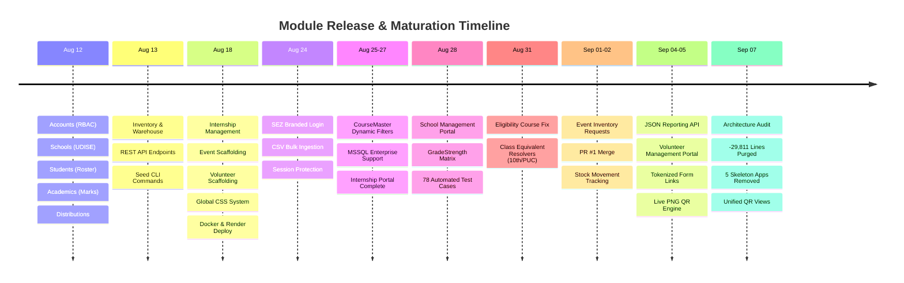

# Aequs EduTrack — Project Timeline & Visual Overview

## Executive Snapshot

* **Project**: Aequs EduTrack (Educational CSR Management Platform)
* **Timeframe**: August 12, 2026 – September 07, 2026
* **Duration**: 27 Calendar Days (14 Active Development Days)
* **Total Git Commits**: 61 Commits (+ Optimization Sprint)
* **Active Engineering Team**: 2 Core Contributors
  * **Rishab / Code-Cool-2006**: 42 Commits (69%) — Lead Architecture, UI/UX, School/Volunteer Portals, Test Suite, DevOps
  * **Saloni Dalvi / salonidalvi-008**: 19 Commits (31%) — Core Scaffolding, Distributions, CourseMaster, Internship Portal, Eligibility
* **Automated Test Suite**: 78 / 78 Automated Tests Passing (100% OK)
* **System Health**: 0 Django System Check Warnings, Clean Production Architecture

---

## Visual Roadmap & Gantt Chart

### High-Resolution Gantt Chart


### Interactive Gantt Timeline

```mermaid
gantt
    title Aequs EduTrack Engineering Timeline
    dateFormat  YYYY-MM-DD
    axisFormat  %b %d

    section Foundation & Scaffolding
    P1: Project Scaffolding & Core Architecture :done, p1, 2026-08-12, 2026-08-13
    P2: REST APIs & Management Commands         :done, p2, 2026-08-13, 2026-08-18

    section UI/UX & Portals
    P3: Major Feature Sprint & Global UI/UX     :done, p3, 2026-08-18, 2026-08-24
    P4: Auth, Bulk Operations & SEZ Branding    :done, p4, 2026-08-24, 2026-08-26
    P5: Dynamic Academics & SQL Server          :done, p5, 2026-08-25, 2026-08-28

    section Core Operations
    P6: School Portal & Automated Test Suite    :done, p6, 2026-08-28, 2026-08-31
    P7: Eligibility Engine & Class Resolvers    :done, p7, 2026-08-31, 2026-09-02
    P8: Inventory Supply Chain & PR #1 Merge    :done, p8, 2026-09-01, 2026-09-04

    section Community & Quality
    P9: Volunteer Portal, QR Codes & Public Form:done, p9, 2026-09-04, 2026-09-06
    P10: Architectural Audit & Code Streamlining:done, p10, 2026-09-05, 2026-09-07
```

---

## Module Evolution & Feature Maturation

### Module Lifecycle Diagram


### Architecture Timeline by Module



---

## Development Phases & Commit Distribution

### Commit Volume & Team Share


---

## Phase-by-Phase Chronological Log

### Phase 1: Project Scaffolding & Core Architecture
* **Dates**: August 12, 2026 | **Commits**: 2 | **Lead**: Saloni Dalvi
* **Key Deliverables**:
  * Initialized Django project with custom User model and 5 RBAC roles (Super Admin, Admin, Accountant, Volunteer, Event Coordinator).
  * Core database models: `School` (UDISE codes, headmasters), `Student` (demographics), `AcademicRecord` (marks, promotion), `EligibilityRecord` (5 benefit types), and `Laptop` / `LaptopAssignment` tracking.
  * Basic list and creation forms for students, schools, and benefit distributions.

### Phase 2: REST APIs & Management Services
* **Dates**: August 13, 2026 | **Commits**: 1 | **Lead**: Rishab
* **Key Deliverables**:
  * Warehouse models: `InventoryItem` and `StockTransaction` for stock-in/stock-out management.
  * Interactive Academics Portal and Inventory Portal templates.
  * Automated CLI seed commands: `seed_schools`, `seed_inventory`, `seed_academics`.
  * Multi-item `StudyKit` services layer.

### Phase 3: Major Feature Sprint, UI/UX Overhaul & Production Deployment
* **Dates**: August 18, 2026 | **Commits**: 19 | **Leads**: Rishab, Saloni Dalvi
* **Key Deliverables**:
  * Added `Internship` module (programs, candidate placements, milestones).
  * Foundational scaffolding for `Events`, `Volunteers`, and `Reports`.
  * **Sidebar Evolution**: 3 iterations (dark $\rightarrow$ unified dark $\rightarrow$ high-contrast royal blue/white light theme).
  * **Global Design System**: Unified typography, custom CSS tokens, compact data density, and shadcn-style card aesthetics.
  * Real-world Belagavi district mock data seeder.
  * **Production Cloud Deployment**: Docker containerization, Render PaaS blueprint, Gunicorn WSGI, Whitenoise static streaming, and PostgreSQL database support.

### Phase 4: Authentication & Bulk Data Operations
* **Dates**: August 24, 2026 | **Commits**: 3 | **Leads**: Rishab, Saloni Dalvi
* **Key Deliverables**:
  * Branded login/logout portal featuring Aequs SEZ background and glassmorphism styling.
  * Session protection and role authentication guards across all portal views.
  * CSV Bulk Upload engine supporting Students, Schools, Academics, and Inventory.

### Phase 5: Academic Enhancements & Enterprise SQL Server
* **Dates**: August 25–27, 2026 | **Commits**: 6 | **Leads**: Saloni Dalvi, Rishab
* **Key Deliverables**:
  * `CourseMaster` model for dynamic curriculum streams and grades.
  * Configured Microsoft SQL Server (`mssql-django` / `pyodbc`) for on-prem enterprise deployments.
  * Completed full Internship Management Portal with milestone tracking and stipend evaluation.

### Phase 6: School Management Portal & Automated Test Suite
* **Dates**: August 28, 2026 | **Commits**: 6 | **Leads**: Rishab, Saloni Dalvi
* **Key Deliverables**:
  * Dedicated School Portal dashboard with grade-by-grade student strength matrix (Classes 1–10).
  * Engineered comprehensive 78-case automated test suite validating models, permissions, and REST endpoints.

### Phase 7: Eligibility Engine Fixes & Class Resolvers
* **Dates**: August 31, 2026 | **Commits**: 5 | **Leads**: Saloni Dalvi, Rishab
* **Key Deliverables**:
  * Fixed critical eligibility bug where higher-education degrees (BE, Diploma, ITI, PUC) were conflated with K-10 school grades.
  * Added resilient class name resolver (`10th` $\leftrightarrow$ `Class 10`, `PUC` $\leftrightarrow$ `12th`).
  * Published initial User Manual and Timeline documentation.

### Phase 8: Inventory Logistics, Resource Requests & PR #1
* **Dates**: September 01–02, 2026 | **Commits**: 5 | **Leads**: Rishab, Saloni Dalvi
* **Key Deliverables**:
  * Event Resource Requests: Event coordinators can request warehouse equipment directly.
  * Repaired inventory bulk upload with atomic transaction handling.
  * Stock status indicators (In Stock, Low Stock, Depleted) in inventory views.
  * Merged Pull Request #1 into main codebase.

### Phase 9: Volunteer Management System, QR Generation & Public Registration
* **Dates**: September 04–05, 2026 | **Commits**: 14 | **Leads**: Rishab, Saloni Dalvi
* **Key Deliverables**:
  * Complete Volunteer Portal: Volunteer directory, hours contributed, event assignments, and activity logs.
  * Tokenized `VolunteerFormLink` generator allowing administrators to share secure external signup links.
  * Live dynamic PNG QR code generation (Reed-Solomon Level H error correction).
  * Public, standalone mobile-responsive volunteer registration page with activity audit logging.
  * Direct CSV and Excel export endpoints for volunteer rosters.

### Phase 10: Architectural Audit & Codebase Streamlining
* **Dates**: September 07, 2026 | **Commits**: 1 sprint | **Lead**: Rishab
* **Key Deliverables**:
  * Purged 17 dead backup and text dump files (`project_frontend.txt`, `*_backup.py`, `*.corrupt-backup`).
  * Removed 5 empty skeleton apps (`audit`, `documents`, `notifications`, `donations`, `expense_management`) from disk and `INSTALLED_APPS`.
  * Unified duplicate QR generation views into a single reusable handler.
  * Removed redundant transitive dependencies (`asgiref`, `sqlparse`) from `requirements.txt`.
  * **Net Impact**: **-29,811 lines of dead code removed**, 78/78 tests passing (100% green), 0 system check issues.

---

## Contributor Breakdown

The repository history reflects contributions from two primary engineers:

| Contributor | Total Commits | % Share | Functional Domain & Architectural Impact |
| :--- | :---: | :---: | :--- |
| **Rishab / Code-Cool-2006** | **42** | **69%** | **Lead Architect, UI/UX & Systems Engineer**<br>• REST APIs & management commands (`seed_schools`, `seed_inventory`, `seed_academics`)<br>• UI/UX design system (3 sidebar iterations, global CSS, shadcn aesthetics)<br>• School Management Portal, Academics Portal, and Inventory Portal<br>• Automated 78-case unit/API test suite (100% passing)<br>• Volunteer Management System (CRUD, public forms, live QR generation)<br>• Production deployment blueprints (Docker, Render, Gunicorn, Whitenoise)<br>• Codebase optimization (-29,811 dead lines purged) |
| **Saloni Dalvi / salonidalvi-008** | **19** | **31%** | **Core Services & Logistics Engineer**<br>• Initial project foundation and core schema scaffolding (13 apps)<br>• Benefit distribution services and Study Kit assembly workflows<br>• Dynamic `CourseMaster` and academic grade/stream filters<br>• Enterprise Microsoft SQL Server (`mssql-django` / `pyodbc`) integration<br>• Full Internship Management Portal (company tracks, milestones, stipends)<br>• Eligibility bugfix (course separation & class equivalent resolution)<br>• Bulk CSV onboarding pipelines across models |

---

## Key Deliverables & Documentation Links

* [PROJECT_TIMELINE.md](file:///d:/Aequs-EduTrack/PROJECT_TIMELINE.md) — This complete markdown overview with interactive Mermaid diagrams and high-res chart embeds.
* [Aequs EduTrack — Project Timeline.docx](file:///d:/Aequs-EduTrack/Aequs%20EduTrack%20%E2%80%94%20Project%20Timeline.docx) — Formal 21-table corporate Word document with embedded high-DPI charts.
* [PROJECT_MODULES.md](file:///d:/Aequs-EduTrack/PROJECT_MODULES.md) — Comprehensive functional and technical specification of all system modules.
* **Visual Chart Assets**:
  * [docs/images/gantt_chart.png](file:///d:/Aequs-EduTrack/docs/images/gantt_chart.png) — 300-DPI Project Gantt Chart
  * [docs/images/module_evolution.png](file:///d:/Aequs-EduTrack/docs/images/module_evolution.png) — 300-DPI Module Evolution Diagram
  * [docs/images/phases_summary.png](file:///d:/Aequs-EduTrack/docs/images/phases_summary.png) — 300-DPI Phase Commits & 2-Contributor Pie Chart
